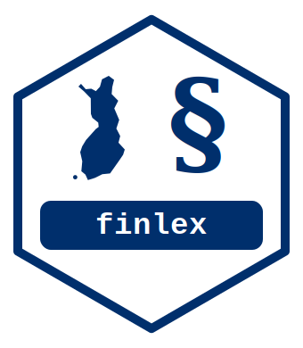

# finlex

**[Documentation site](https://kristianvepsalainen.github.io/finlex/)**

<!-- badges: start -->
[](https://github.com/KristianVepsalainen/finlex/actions/workflows/R-CMD-check.yaml)
[](https://CRAN.R-project.org/package=finlex)
<!-- badges: end -->

**finlex** provides R functions to retrieve and structure Finnish
legislative data from the [Finlex Open Data
API](https://www.finlex.fi/en/open-data). 

## Installation

```r
# install.packages("pak")
pak::pak("KristianVepsalainen/finlex")
```

## Usage

```r
library(finlex)

# All new statutes issued in 2023
statutes <- flx_download_statutes(
  start_year = 2023, end_year = 2023,
  categories = "new-statute"
)

# Title of a single statute
flx_get_title(year = 1992, number = 1535) # Tuloverolaki (Income Tax Act)

# Structured metadata: date issued, title, number of sections
flx_get_metadata(year = 1992, number = 1535)

# What statutes does a given amending statute affect?
flx_get_affected(year = 2023, number = 2)
```

## Status

The package is at a very early stage of development (0.0.0.9000). The
first goal is to reach a CRAN-ready baseline of functionality.

## Using finlex commercially?

finlex is released under the MIT license, so you're free to use it in
commercial products and services with no obligation to ask permission.
That said, if you do use it commercially or in research, I'd genuinely
love to hear about it — drop a line at kristian.vepsalainen@proton.me.
It's not required, just appreciated.
